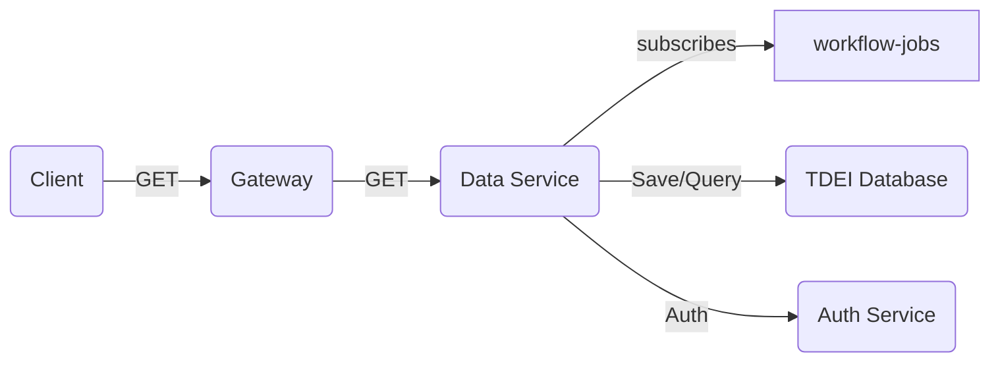

# Introduction 
The Data Service microservice is responsible for persisting and querying dataset information within the TDEI system. It acts as the primary interface for managing dataset storage, retrieval, and processing.

## Getting Started
The project is built on NodeJS framework. All the regular nuances for a NodeJS project are valid for this.

## System requirements
| Software | Version|
|----|---|
| NodeJS | 16.17.0|
| Typescript | 4.8.2 |

## Environment variables

Application configuration is read from .env file. Below are the list of environemnt variables service is dependent on. An example of environment file is available [here](./env.example) and description of environment variable is presented in below table

|Name| Description |
|--|--|
| PROVIDER | Provider for cloud service or local (optional)|
|QUEUECONNECTION | Queue connection string |
|STORAGECONNECTION | Storage connection string|
|PORT |Port on which application will run|
|AUTH_HOST | Authentication/Authorization url|
|POSTGRES_DB | Database name|
|POSTGRES_HOST| Link to the database host |
|POSTGRES_USER| Database user |
|POSTGRES_PASSWORD| Database user password|
|SSL| Database ssl flag|
|GATEWAY_URL | Gateway Url|

## Local Postgresql database setup

Step 1: Ensure all the environment variables are setup.

Step 2: Ensure docker is installed on local system. 

Step 3: Run below command which will setup Postgresql database and PgAdmin client console for postgresql database.

```docker compose up```  from root directory

The above command will invoke and bring up two dockers running as a single group
- postgresql with gis , default user/password is `admin`. 
- pgadmin tool for GUI

step 4: Update the env variables values with database details

## Build

Follow the steps to install the node packages required for both building and running the application

1. Install the dependencies. Run the following command in terminal on the same directory level as `package.json`
    ```shell
    npm install
    ```
2. To start the server, use the command `npm run start`
3. The http server by default starts with 3000 port or whatever is declared in `process.env.PORT` (look at `index.ts` for more details)
4. Health check available at path `health/ping` with get and post. Make `get` or `post` request to `http://localhost:3000/health/ping`.
Ping should respond with "healthy!" message with HTTP 200 status code.

## Test

Follow the steps to install the node packages required for testing the application

1. Ensure we have installed the dependencies. Run the following command in terminal on the same directory level as `package.json`
    ```shell
    npm install
    ```
2. To start testing suits, use the command `npm test` , this command will execute all the unit test suites defined for application.

## How to run integration test
To run integration test you need a .env file which will be available on request.

Steps to run:

Execute the following commands.

```
npm run i
```

``` 
npm run test:integration
```


## Required env for running tests

For running integration test, following env variables are required.

|Name| Description |
|--|--|
|QUEUECONNECTION | Queue connection string |
|STORAGECONNECTION | Storage connection string|
|AUTH_HOST | Host of the authentication service |
|GATEWAY_URL | Upload topic subscription name|

## Test Enumeration

When new test cases are written, it is required to run `npm run generate-test-enumeration` which will update the test-enumeration.md file with latest test case changes.

## Constraints

1. The maximum size for the payload of a POST request is restricted to 100kb.

## OSW entity identification fields
OpenSidewalks Schema entities are identified by their set of attributes. Fields that uniquely identify an entity type are called identifying fields, this information is required for tag quality metric.
below is the command to run whenever the new OSW schema gets generated. 

```shell
node generate-test-enumeration.js
```

* Please review and update the script when OSW schema version changes.

## System flow
---

Diagram describes the Data service system flow



- Sample GET calls interaction with DB

```mermaid
sequenceDiagram
sequenceDiagram
    Client->>+Gateway:GET(Dataset)
    Gateway->>+Dataservice: GET
    Dataservice->>+Database: QUERY
    Database->>+Dataservice:Result
    Dataservice->>+Gateway:List of Dataset
    Gateway->>+Client: Dataset list
```