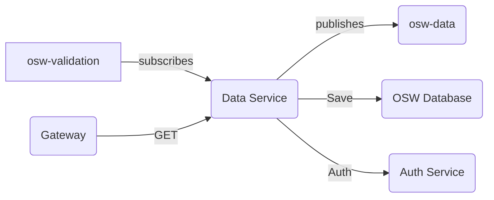

# Introduction 
Data service micro-service helps TDEI system to query & persist the information specific to the OSW.

# Getting Started
The project is built on NodeJS framework. All the regular nuances for a NodeJS project are valid for this.

## System requirements
| Software | Version|
|----|---|
| NodeJS | 16.17.0|
| Typescript | 4.8.2 |

## Environment variables

Application configuration is read from .env file. Below are the list of environemnt variables service is dependent on. An example of environment file is available [here](./env.example) and description of environment variable is presented in below table

|Name| Description |
|--|--|
| PROVIDER | Provider for cloud service or local (optional)|
|QUEUECONNECTION | Queue connection string |
|STORAGECONNECTION | Storage connection string|
|PORT |Port on which application will run|
|VALIDATION_SUBSCRIPTION | Upload topic subscription name|
|VALIDATION_TOPIC | Validation topic name|
|AUTH_PERMISSION_URL | Authentication/Authorization url|
|DATASVC_TOPIC | Data service publishing topic|
|POSTGRES_DB | Database name|
|POSTGRES_HOST| Link to the database host |
|POSTGRES_USER| Database user |
|POSTGRES_PASSWORD| Database user password|

## Local Postgresql database setup

Step 1: Ensure all the environment variables are setup.

Step 2: Ensure docker is installed on local system. 

Step 3: Run below command which will setup Postgresql database and PgAdmin client console for postgresql database.

```docker compose up from root directory```

## Build and Test

Follow the steps to install the node packages required for both building and running the application

1. Install the dependencies. Run the following command in terminal on the same directory as `package.json`
    ```shell
    npm install
    ```
2. To start the server, use the command `npm run start`
3. The http server by default starts with 3000 port or whatever is declared in `process.env.PORT` (look at `index.ts` for more details)
4. Health check available at path `health/ping` with get and post. Make `get` or `post` request to `http://localhost:3000/health/ping`


## System flow

Diagram describes the Data service system flow



- Data service, subscribes to `osw-validation` topic to listen to validation results of the osw file upload request.

- Data service, authorizes the request via `Auth Service` 

- If validation result is failed , Data service publishes the information to `osw-data` topic to update request status complete without persisting the information.

- If validation result is successful , Data service first persists the information to the database and publishes the information to `osw-data` topic to update request status complete.

- `osw-validation` topic message schema can be found [here](https://github.com/TaskarCenterAtUW/TDEI-event-messages/blob/dev/schema/osw-validation-schema.json)

- `osw-data` topic message schema can be found [here](https://github.com/TaskarCenterAtUW/TDEI-event-messages/blob/dev/schema/osw-validation-schema.json)

- `Gateway Service`, makes HTTP GET calls to 
    - Retrive the list of OSW files with/without search criteria.
    - Download the OSW file given the tdei_record_id


