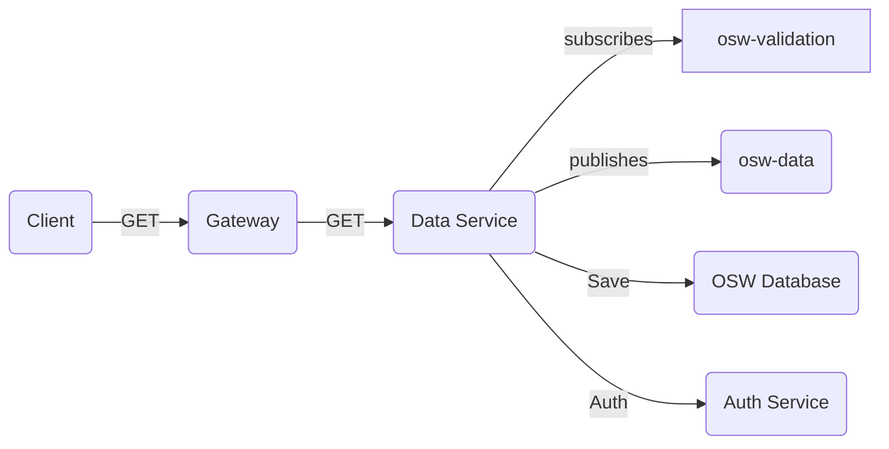
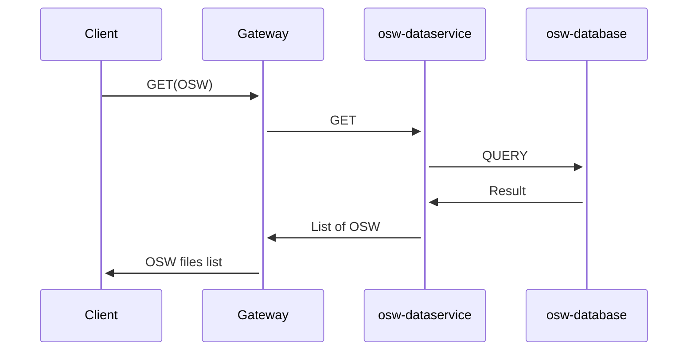

# Introduction 
Data service micro-service helps TDEI system to persisting & querying the information specific to the OSW.

## Getting Started
The project is built on NodeJS framework. All the regular nuances for a NodeJS project are valid for this.

## System requirements
| Software | Version|
|----|---|
| NodeJS | 16.17.0|
| Typescript | 4.8.2 |

## Environment variables

Application configuration is read from .env file. Below are the list of environemnt variables service is dependent on. An example of environment file is available [here](./env.example) and description of environment variable is presented in below table

|Name| Description |
|--|--|
| PROVIDER | Provider for cloud service or local (optional)|
|QUEUECONNECTION | Queue connection string |
|STORAGECONNECTION | Storage connection string|
|PORT |Port on which application will run|
|AUTH_HOST | Authentication/Authorization url|
|DATASVC_TOPIC | Data service publishing topic|
|POSTGRES_DB | Database name|
|POSTGRES_HOST| Link to the database host |
|POSTGRES_USER| Database user |
|POSTGRES_PASSWORD| Database user password|
|GATEWAY_URL | Gateway Url|
|USER_MANAGEMENT_HOST | User management url |

## Local Postgresql database setup

Step 1: Ensure all the environment variables are setup.

Step 2: Ensure docker is installed on local system. 

Step 3: Run below command which will setup Postgresql database and PgAdmin client console for postgresql database.

```docker compose up```  from root directory

## Build

Follow the steps to install the node packages required for both building and running the application

1. Install the dependencies. Run the following command in terminal on the same directory level as `package.json`
    ```shell
    npm install
    ```
2. To start the server, use the command `npm run start`
3. The http server by default starts with 3000 port or whatever is declared in `process.env.PORT` (look at `index.ts` for more details)
4. Health check available at path `health/ping` with get and post. Make `get` or `post` request to `http://localhost:3000/health/ping`.
Ping should respond with "healthy!" message with HTTP 200 status code.

## Test

Follow the steps to install the node packages required for testing the application

1. Ensure we have installed the dependencies. Run the following command in terminal on the same directory level as `package.json`
    ```shell
    npm install
    ```
2. To start testing suits, use the command `npm test` , this command will execute all the unit test suites defined for application.

## Test Enumeration

When new test cases are written, it is advise to run `npm run generate-test-enumeration` which will update the test-enumeration.md file with latest test case changes.

## System flow
---

Diagram describes the Data service system flow



- `Client`, makes HTTP GET calls to `Gateway`
    - Retrive the list of OSW files with/without search criteria.
    - Download the OSW file given the tdei_record_id
    
- `Data Service`, authorizes the every incoming request against the `Auth Service` 

- `Data Service`, subscribes to `osw-validation` topic to listen to data validation of the osw file upload request.

- If validation is failed , Data Service publishes the information to `osw-data` topic to update request status complete without persisting the information.

- If validation is successful , Data Service first persists the information to the `OSW Database` and publishes the information to `osw-data` topic to update request status complete.

- `osw-validation` topic message schema can be found [here](https://github.com/TaskarCenterAtUW/TDEI-event-messages/blob/dev/schema/osw-validation-schema.json)

- `osw-data` topic message schema can be found [here](https://github.com/TaskarCenterAtUW/TDEI-event-messages/blob/dev/schema/osw-validation-schema.json)


- Sample GET calls interaction with DB




## How to run integration test
To run integration test you need a .env file which will be available on request.

Steps to run:

Execute the following commands.

```
npm run i
```

``` 
npm run test:integration
```


## Required env for running tests

For running integration test, following env variables are required.

|Name| Description |
|--|--|
|QUEUECONNECTION | Queue connection string |
|STORAGECONNECTION | Storage connection string|
|AUTH_HOST | Host of the authentication service |
|VALIDATION_SUBSCRIPTION | Upload topic subscription name|
|VALIDATION_TOPIC | Validation topic name|
|DATASVC_TOPIC | Data service publishing topic|

## File upload implementation

The file upload implementation is done as per the existing upload API.

Path : `/api/v1/osw`

Method : `POST`

Form data : Contains two requred and one optional file

`metadata`: Payload in JSON format 

`dataset`: The zip file for osw

`changeset`: Optional, file containing upload details

Example for metadata 

```json

{
    "name": "Sample OSW Upload",
    "version": "1.0.2",
    "description": "This is a sample OSW upload.",
    "custom_metadata": {},
    "collected_by": "John Doe",
    "collection_date": "2024-01-18 21:17:48.357173-08",
    "collection_method": "transform",
    "data_source": "3rdParty",
    "osw_schema_version": "v0.1",
    "valid_from": "2024-01-18 21:17:48.357173-08",
    "valid_to": "2024-01-19 22:17:48.357173-08",
    "dataset_area": {
        "type": "FeatureCollection",
        "features": [
            {
                "type": "Feature",
                "id": "1",
                "properties": {},
                "geometry": {
                    "type": "Polygon",
                    "coordinates": [
                        [
                            [
                                30.0,
                                10.0
                            ],
                            [
                                40.0,
                                40.0
                            ],
                            [
                                20.0,
                                40.0
                            ],
                            [
                                10.0,
                                20.0
                            ],
                            [
                                30.0,
                                10.0
                            ]
                        ]
                    ]
                }
            }
        ]
    }
}

```
## Execution of flow

The flow of processing is as follows
1. Middleware auth verification
2. File format verification
3. Meta validation of upload
4. Generating random UID (recordID)
5. Uploading to Storage (with path)
6. Assigning path, recordID and creating DTO 
7. Verifying the serviceID against projectGroupID and inserting into the Database
8. Responding with recordID

### 1. Middleware for auth verification
- This step verifies the `Bearer` token for userID and also parses the `userId` from the header.
- The `userID` is inserted into body as `body.userId` for further processing
- The userId is checked for authentication to upload against the auth URL.

Any error in this is dealt with a 401 Unauthorized error

### 2. File format verification
This middleware verifies that the uploaded file is in `.zip` extension and reponds with 400 bad request if the file is not a zip file

### 3. Meta validation
The `meta` body is parsed and is validated according to the initial validation conditions Any error is responded back with 500 error with the message

<!-- ### 4&5. Generating randomUID and upload

Random UUID is generated which will be assigned as `tdei_record_id`. The uploaded file is transferred to storage with path. The path for storage is
`yyyy/mm/<tdeiProjectGroupId>/<tdeirecordID>`

Eg.
- tdeiProjectGroupId - abc
- tdeiRecordId - def

Uploaded on 23rd August  2023 will be stored in (if the file name is `attrib.zip`)

`2023/08/abc/def/attrib.zip` -->

### 6&7: Assigning the path and record id and inserting into DB
An initial DTO (Data object) is created with the meta data along with the uploaded path, userID and the record ID. There is a check made to ensure the serviceId belongs to the  project group. After the verification, the data is inserted into the DB. Queuemessage for upload is also scheduled here.

### 8:Response
The recordID generated in step 4 is sent back as response to the user.


## Steps to run local database

To run the local database setup, you will have to bring up the `postgresql` server separately in a docker

### Bring up the db server and pgadmin tool

`docker compose up` 

The above command will invoke and bring up two dockers running as a single group
- postgresql with gis
- pgadmin tool for GUI

### Add local server in pgadmin tool
- go to http://localhost:5000 and add server with the following parameters

- server name : Local
- host: postgres
- user: POSTGRES_USER in .env file
- password: POSTGRES_PASSWROD in .env file

### Import gtfs-osw database structure
- In the sql query tool of the gtfs-osw database, execute the query available in `src/scripts/init.sql`

The database is ready to be connected to the service

### Edit the host in .env file
In the `.env` file, `POSTGRES_HOST=localhost` and run the service with `npm run start`

## Confidence metric implementation and APIs

There are two APIs exposed for calculating the confidence metric for record

### Initiate  Confidence metric calculation

PATH : `/api/v1/osw/confidence/calculate`

Method: POST

Body:

```json
{
      "tdeiRecordId":"<tdeiRecord ID>"
}

```

Response:

```json
{
  "tdeiRecordId":"<tdeiRecord ID>",
  "jobId":"<jobId>",
  "statusUrl":"<status URL>"
}

```

### Get status of the confidence metric job

PATH: `/api/v1/osw/confidence/status/<jobId>`

Method: GET

Response:

```json
{
    "jobId":"<jobId>",
    "confidenceValue":"float or 0 if not calculated",
    "status":"started/calculated/failed",
    "updatedAt":"Date time of the last update of the status",
    "message":"Response message containing error or status information"
}

```

The status can be any of `started`, `calculated` or `failed`

| Status | Description |
|-|-|
| started | Initiated the calculation. Waiting for confidence service to respond|
| calculated| Calculation done. The value is in `confidenceValue` |
| failed | Confidence service failed to calculate. `message` will have the error |


## On demand formatting for osw

On demand formatting is done by uploading a type of format.

### On demand format upload API 

PATH: `/api/v1/convert/upload`

Method : POST

Body: (multipart-form-data)

|Key | Description|
|-|-|
|source| From format (osw or osm) |
| target | To format (osw or osm) should not be same as source |
| file | input file  to be converted|

Response:

```json
{
    "jobId":"<jobId>",
    "statusUrl":"<status url >"
}

```

### Status request API

Path: `/api/v1/osw/convert/status/<jobId>`

Method: `GET`

Response:

```json
{
    "jobId":"<jobId>",
    "status":"<started/completed/failed>",
    "message":"<any error message. will be blank for completed or started>",
    "downloadUrl":"<url to download the formatted set>",
    "conversion":"<type of conversion> osm-osw or osw-osm"
}

```

### Formatted file download API

Path : `/api/v1/osw/convert/download/<jobId>`
Method: `GET`

Response:

File content with the name as per the conversion parameters.
For osm, output is in .xml format
For osw, output is in .zip format